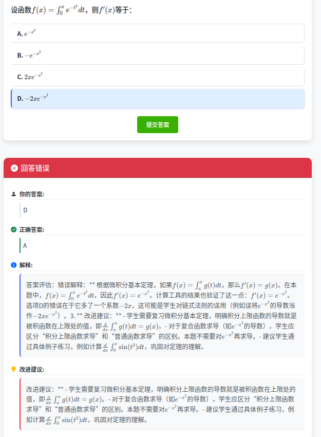

# 数学题练习系统

[English](README_EN.md) | 中文

这是一个使用LLM（大型语言模型）生成数学题的Web应用程序，支持选择题、填空题和计算题，并提供AI反馈。系统使用中文生成问题和反馈，适合中文使用者学习数学。系统支持LaTeX格式的数学公式，提供清晰美观的数学表达式显示。

## 效果展示

### 问题页面


### 答案反馈



## 功能特点

- 使用LLM生成格式化的数学问题，支持中文输出
- 支持多种题型：选择题、填空题、计算题
- 支持不同难度级别（简单、中等、困难）和数学领域（代数、几何、三角函数、微积分、概率统计）
- 用户回答后提供详细的中文AI反馈和改进建议
- 响应式Web界面，适配各种设备
- 集成强大的数学计算工具，支持复杂表达式计算
- 智能错误处理，能够修复常见的数学表达式输入错误
- 每次生成不同的随机问题，提供多样化的练习内容
- 支持LaTeX格式的数学公式，使用KaTeX渲染，提供清晰美观的数学表达式显示
- 简化的JSON解析逻辑，提高系统稳定性和效率
- 优化的计算工具使用，减少不必要的计算调用

## 技术栈

- 后端：FastAPI、Langchain、DeepSeek API
- 前端：HTML、CSS、JavaScript、Bootstrap
- 数学公式渲染：KaTeX
- 数学计算：SymPy，支持展开、因式分解、求导、积分、矩阵运算等
- 数据模型：Pydantic，支持类型检查和数据验证
- 模板引擎：Jinja2，用于渲染HTML模板

## 安装与运行

1. 确保已安装Python 3.8+

2. 克隆仓库
   ```bash
   git clone https://github.com/yourusername/math_questions.git
   cd math_questions
   ```

3. 安装所需依赖
   ```bash
   pip install -r requirements.txt
   ```

4. 配置API密钥
   在`app/config.py`文件中配置您的DeepSeek API密钥。默认情况下，系统会尝试从环境变量`DEEPSEEK_API_KEY`中读取密钥。您可以设置环境变量或直接在配置文件中修改。
   ```bash
   # Linux/Mac
   export DEEPSEEK_API_KEY="your-api-key"

   # Windows
   set DEEPSEEK_API_KEY=your-api-key
   ```

5. 运行应用
   ```bash
   python run.py
   ```

6. 在浏览器中访问 http://localhost:8000

## 项目结构

```
math_questions/
├── app/                  # 应用程序代码
│   ├── __init__.py
│   ├── main.py           # FastAPI主应用
│   ├── models.py         # 数据模型
│   ├── question_gen.py   # 问题生成器
│   ├── feedback_gen.py   # 反馈生成器
│   └── config.py         # 配置文件
├── static/               # 静态文件
│   ├── css/
│   │   └── styles.css
│   └── js/
│       └── main.js
├── templates/            # HTML模板
│   └── index.html
└── run.py                # 启动脚本
```

## 使用说明

1. 在首页选择问题类型、难度级别和数学领域
2. 点击"生成问题"按钮生成新问题
3. 回答问题（选择选项或输入答案）
4. 点击"提交答案"获取AI反馈
5. 查看反馈并点击"生成新问题"继续练习

## 特殊功能

1. **数学表达式错误处理**：系统能够自动修复常见的数学表达式输入错误，如：
   - 中文括号和标点符号转换
   - 修复 sinx 为 sin(x) 的格式
   - 将 x^2 转换为 x**2 格式
   - 将 2x 转换为 2*x 格式

2. **随机问题生成**：每次生成不同的随机问题，避免重复练习相同的问题。

3. **中文反馈**：系统提供详细的中文反馈和解析，帮助用户更好地理解问题。

4. **LaTeX数学公式支持**：系统在问题和反馈中使用LaTeX格式的数学公式，如$f(x) = x^2$和$\frac{1}{2}$，提供清晰美观的数学表达式显示。

5. **智能计算工具使用**：系统会智能判断何时使用计算工具，避免对简单计算也使用工具，提高效率。

6. **简化的JSON解析**：使用直接文本提取而非JSON解析，提高系统稳定性和效率。

## 注意事项

- 默认使用DeepSeek API，已在config.py中配置，可从环境变量DEEPSEEK_API_KEY中读取密钥
- 生成问题和反馈可能需要一些时间，请耐心等待
- 数学公式使用LaTeX格式，由KaTeX渲染，支持各种复杂的数学表达式
- 使用LangChain进行数学计算，已优化为只在复杂计算时使用工具
- 集成高级数学计算工具，支持复杂表达式计算、无穷积分、矩阵运算等
- 系统使用直接文本提取而非JSON解析，提高稳定性
- 如果遇到问题，可以查看控制台日志了解详情

## 贡献

欢迎提交问题和改进建议！如果您想贡献代码，请先创建一个issue讨论您想要改变的内容。

## 许可证

本项目采用MIT许可证 - 详情请参阅LICENSE文件。
